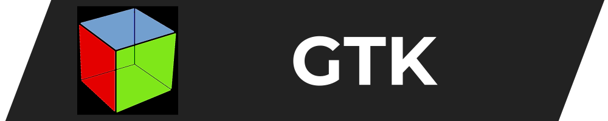
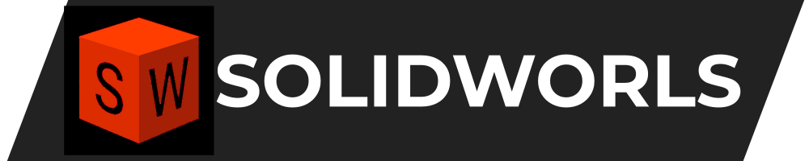

<!--
SPDX-FileCopyrightText: 2024-2025 Rafael V. Volkmer <rafael.v.volkmer@gmail.com>
SPDX-License-Identifier: MIT
-->

# > Rafael V. Volkmer  
`Electronics Technician · Computer Engineer · Software/Hardware Developer`

Technical Lead in automotive embedded systems, working end-to-end across **hardware, firmware, and Linux/bare-metal platforms**. I design, implement, and integrate systems for industrial and automotive automation, collaborating directly with **semiconductor vendors** and **end customers** to take products from concept to production.

I’m strongly focused on **clean, maintainable code** and **scalable architectures** in large repositories: low technical debt, solid modularization, and documentation that actually helps people. I enjoy mentoring, code reviewing, and building a healthy engineering culture based on empathy and knowledge sharing.

Self-taught and curiosity-driven, I’m constantly learning new tools, languages, and methodologies — and I like to bridge them between **software** and **hardware** worlds.

---

<!-- Title with GIF and text side by side -->
<h1 style="display: inline-flex; align-items: center; gap: 8px;">
  
  Tech Stack
</h1>

| Area | Technologies |
|------|--------------|
| **System** |      |
| **Embedded** |      |
| **Build** |     </a>    |
| **Platforms** |       |
| **OS** |        | 
| **Script** |       |
| **Description** |      |
| **Version** |      |
| **BackEnd** |        |
| **FrontEnd** |     |
| **Database** |    |
| **DevOps** |         |
| **CI/CD** |       |
| **Hardware** |         |
| **Docs** |      |

---

# > Featured Projects

| Project | Stack | Description | Links | Status |
|--------|-------|-------------|-------|--------|
| **libmemalloc** |   | Modern custom allocator in C, designed for observability, safety checks, and pluggable strategies. | [Repo][p-libmemalloc-repo] · [Docs][p-libmemalloc-docs] · [Releases][p-libmemalloc-releases] | ◷ Under development |
| **CodeAudit** |  | Parallel code quality and metrics analyzer in Go, aggregating complexity, comments, duplication, and git hotspot data for C/C++ and Go projects. | [Repo][p-codeaudit-repo] | ◷ Under development |

---
[p-libmemalloc-repo]: https://github.com/RafaelVVolkmer/libmemalloc
[p-libmemalloc-docs]: https://rafaelvvolkmer.github.io/libmemalloc
[p-libmemalloc-releases]: https://github.com/RafaelVVolkmer/libmemalloc/releases
[p-codeaudit-repo]: https://github.com/RafaelVVolkmer/codeaudit
